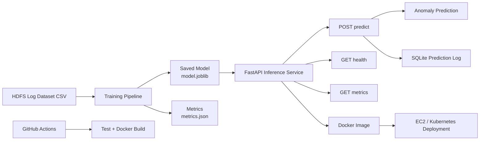
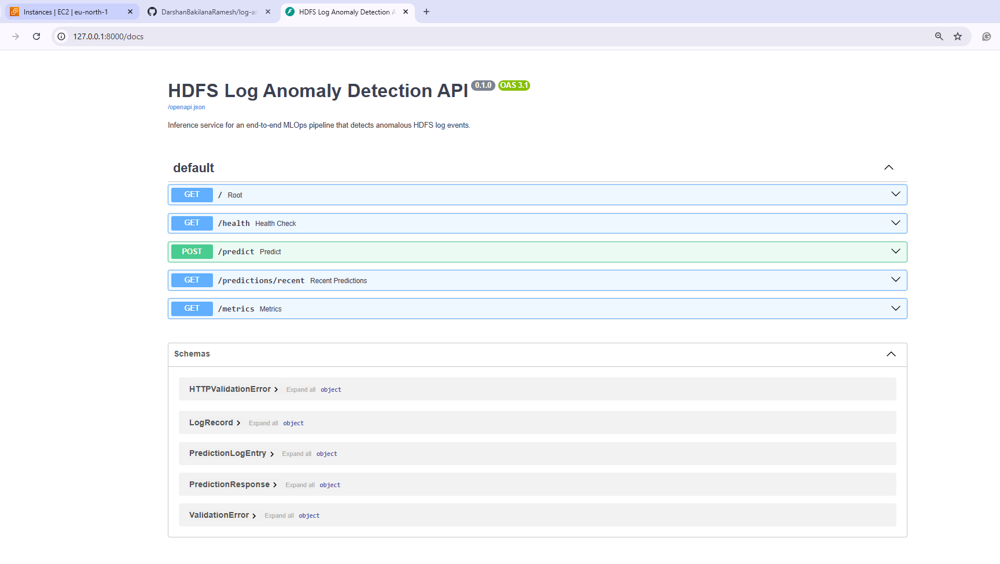
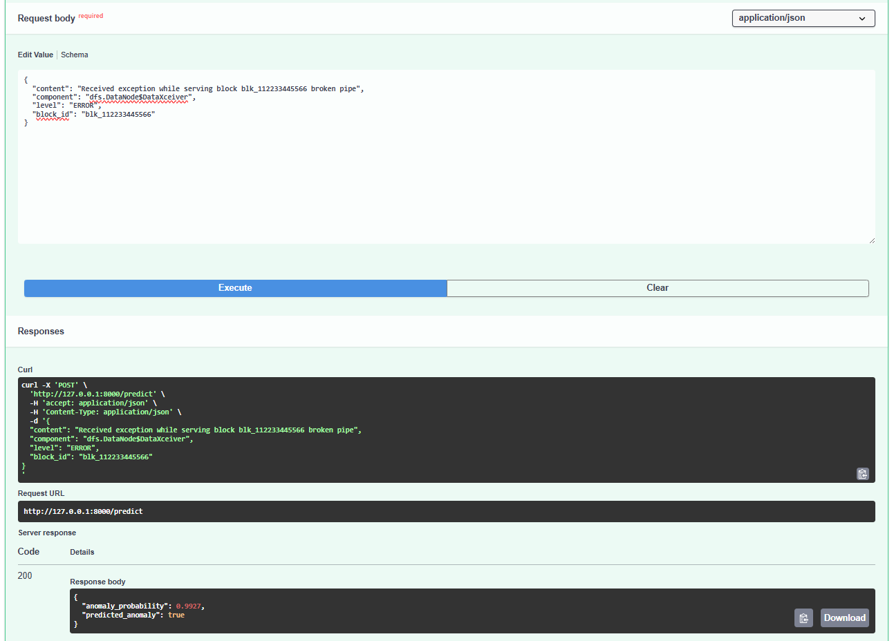
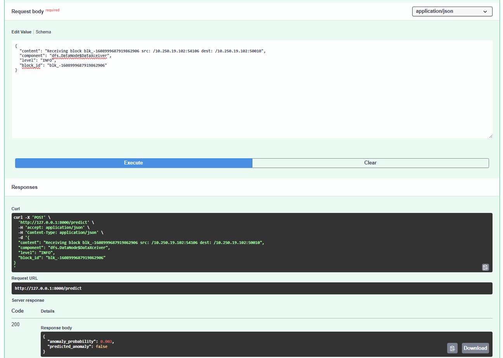
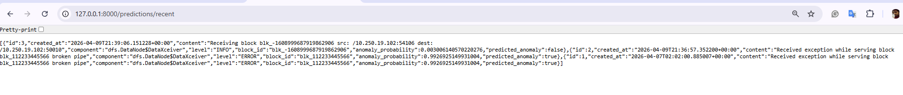
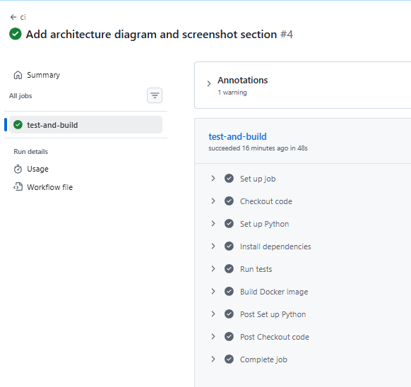
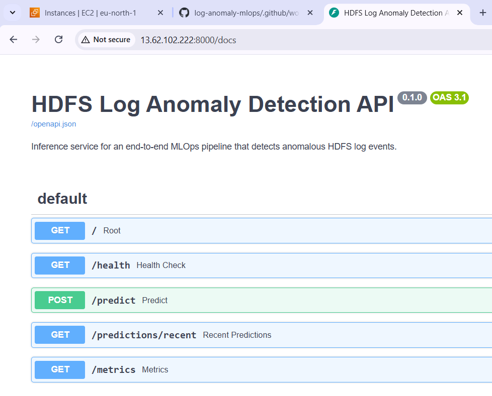

# HDFS Log Anomaly Detection MLOps Project

This project is a practical MLOps workflow for detecting anomalous HDFS log events.

The idea is simple: train a model on historical HDFS logs, serve that model through an API, store prediction history, package everything with Docker, validate changes with GitHub Actions, and run the service on AWS EC2. Kubernetes manifests are also included so the project is ready for cluster-based deployment on a machine with enough resources.

## What the project does

Distributed systems generate a huge number of log messages, and manually reviewing them is not realistic. This project helps by classifying a new HDFS log event as normal or anomalous.

Given a new log, the system returns:
- the anomaly probability
- the final anomaly / non-anomaly prediction

## Why this project is useful

This is not just a model training script. It shows the full path from data to deployment:
- training a machine learning model
- exposing it through a FastAPI service
- logging predictions in SQLite
- packaging the application with Docker
- validating the codebase with GitHub Actions
- deploying the service on EC2
- preparing the app for Kubernetes deployment

## How it works

At a high level, the flow looks like this:
1. Load HDFS log data from `data/raw/`
2. Train a text classification model
3. Save the trained model and evaluation metrics
4. Start the FastAPI inference service
5. Send new logs to `/predict`
6. Return the prediction result
7. Store prediction history in SQLite
8. Expose service health and Prometheus metrics

## Architecture Diagram



## Tech stack

ML and API:
- Python
- Pandas
- Scikit-learn
- FastAPI
- Uvicorn

MLOps and DevOps:
- Docker
- GitHub Actions
- SQLite
- Kubernetes manifests
- Prometheus metrics
- AWS EC2

## Project structure

```text
.
|-- app/
|-- artifacts/
|-- data/
|-- docs/
|-- helm/
|-- k8s/
|-- src/
|-- tests/
|-- .github/workflows/
|-- Dockerfile
|-- docker-compose.yml
`-- requirements.txt
```

Important files:
- `src/models/train.py` for training
- `src/data/hdfs.py` for fallback sample data
- `app/main.py` for the FastAPI service
- `src/utils/prediction_store.py` for SQLite prediction logging
- `tests/` for training and API tests
- `k8s/` for Kubernetes manifests
- `.github/workflows/ci.yml` for CI

## Dataset

The project expects an HDFS anomaly dataset with these main columns:
- `content`
- `component`
- `level`
- `block_id`
- `anomaly`

A real CSV can be placed in `data/raw/` for local training.

Example schema:

```csv
content,component,level,block_id,anomaly
"Receiving block blk_-1608999687919862906 src: /10.250.19.102:54106 dest: /10.250.19.102:50010","dfs.DataNode$DataXceiver",INFO,"blk_-1608999687919862906",0
"Received exception while serving block blk_112233445566 broken pipe","dfs.DataNode$DataXceiver",ERROR,"blk_112233445566",1
```

Large raw datasets are intentionally not committed to GitHub. If no real CSV is present, the project falls back to a tiny built-in sample dataset so the application can still run.

## Model training

Training happens in `src/models/train.py`.

In short, it:
- reads the first CSV from `data/raw/`
- falls back to sample data if no CSV exists
- vectorizes the log text with TF-IDF
- encodes categorical features such as component, level, and block ID
- trains a Logistic Regression classifier
- evaluates the model
- saves the model and artifacts in `artifacts/`

Artifacts produced:
- `artifacts/model.joblib`
- `artifacts/metrics.json`
- `artifacts/sample_payload.json`
- `artifacts/predictions.db`

## API

Local base URL:
- `http://127.0.0.1:8000`

Available endpoints:
- `GET /` for a basic service message
- `GET /health` for health status and training metrics
- `POST /predict` for anomaly prediction
- `GET /predictions/recent` for recent prediction history
- `GET /metrics` for Prometheus-compatible metrics

Example `/predict` request:

```json
{
  "content": "Received exception while serving block blk_112233445566 broken pipe",
  "component": "dfs.DataNode$DataXceiver",
  "level": "ERROR",
  "block_id": "blk_112233445566"
}
```

Example response:

```json
{
  "anomaly_probability": 0.9927,
  "predicted_anomaly": true
}
```

## Prediction logging

Every prediction is stored in SQLite so the service behaves more like a real production system.

Each stored entry includes:
- timestamp
- log content
- component
- level
- block ID
- anomaly probability
- predicted anomaly label

Example:

```bash
curl "http://127.0.0.1:8000/predictions/recent?limit=10"
```

## Run locally

Create and activate a virtual environment:

```bash
python -m venv .venv
.venv\Scripts\activate
pip install -r requirements.txt
```

Train the model:

```bash
python -m src.models.train
```

Start the API:

```bash
python -m uvicorn app.main:app --reload
```

Then open:
- `http://127.0.0.1:8000/docs`
- `http://127.0.0.1:8000/health`

Run tests:

```bash
python -m pytest
```

## Docker

Build the image:

```bash
docker build -t hdfs-log-anomaly-api .
```

Run the container:

```bash
docker run -p 8000:8000 hdfs-log-anomaly-api
```

Or use Compose:

```bash
docker compose up --build
```

## GitHub Actions

The CI workflow runs on push and pull request. It:
- installs dependencies
- runs the test suite
- builds the Docker image

This gives a quick signal that the project is healthy and container-ready.

## EC2 deployment

The Dockerized API was tested and deployed on AWS EC2.

Typical flow:
1. clone the repository on EC2
2. build the Docker image
3. run the container on port `8000`
4. open port `8000` in the EC2 security group
5. access the API from the browser

Example deployed endpoints:
- `http://<EC2-PUBLIC-IP>:8000/health`
- `http://<EC2-PUBLIC-IP>:8000/docs`

One important note: if the real dataset is not copied to EC2, the container will use the built-in fallback sample dataset.

## Screenshots

### Swagger UI



### Anomaly Prediction Example



### Normal Prediction Example



### Recent Prediction History



### GitHub Actions CI Success



### EC2 Deployment



## Kubernetes

Kubernetes manifests are included in `k8s/` for deployment and service exposure.

Included resources:
- deployment manifest
- service manifest
- Prometheus ServiceMonitor manifest

Current status:
- the Kubernetes manifests are prepared
- the project is ready for Minikube or EKS-style rollout on a machine with enough resources
- Minikube was not fully validated on the small EC2 test instance because of resource limits

So the Kubernetes part of the project is prepared, but not yet fully validated on a larger cluster.

## Current status

The project currently includes:
- real local training on HDFS anomaly data
- a working FastAPI inference service
- anomaly and non-anomaly predictions
- prediction logging with SQLite
- Docker packaging
- GitHub Actions CI
- EC2 deployment
- Kubernetes manifests prepared for the next deployment step

## Future improvements

Some good next steps would be:
- validate the Kubernetes deployment on a stronger machine or managed cluster
- make EC2 use the full real dataset as well
- add experiment tracking with MLflow
- add drift monitoring
- expose model version metadata
- improve preprocessing with duplicate removal and more data-quality checks
